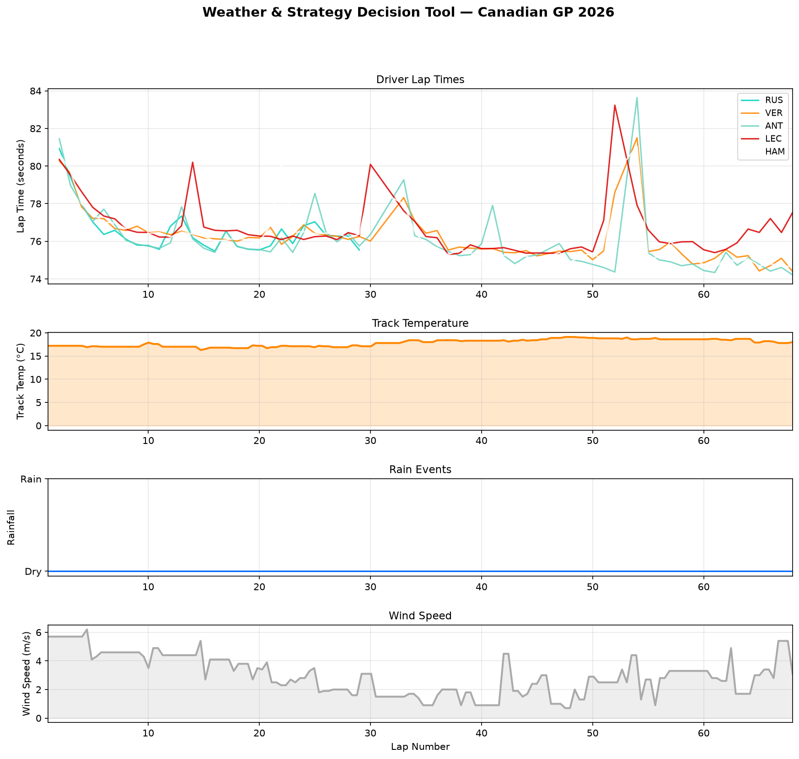

# F1 Weather & Strategy Decision Tool

A Python tool that overlays real weather data with driver lap times to analyse 
how track conditions influenced strategy decisions during a Formula 1 Grand Prix.

## What it does

This script loads race telemetry and weather data for a chosen Grand Prix and 
produces four stacked charts sharing the same lap number axis:

- Driver lap times — showing how pace evolves as conditions change
- Track temperature — warmer track means more tyre grip and faster lap times
- Rainfall events — showing exactly when rain hit the circuit
- Wind speed — crosswinds affect car balance and aerodynamic performance

## Example Output

This example analyses the 2026 Canadian GP. The race was completely dry with a 
stable track temperature of around 19°C throughout, making tyre degradation 
predictable and strategy decisions straightforward. Wind speed started high at 
6 m/s and gradually dropped through the race, affecting car balance through 
Montreal's famous chicanes.

## Tech Stack

- Python
- [FastF1](https://github.com/theOehrly/Fast-F1) — official F1 timing and telemetry data
- Matplotlib — data visualisation
- Pandas — data handling
- NumPy — numerical calculations

## How to Run

1. Install dependencies: `pip install fastf1 matplotlib pandas numpy`
2. Run the script: `python weather_strategy.py`
3. Chart will display and save as `weather_strategy.png`

## Why This Project

Weather is one of the most complex variables in race strategy. A sudden rain 
shower can completely change the optimal pit window, tyre compound choice, and 
track position management. This tool builds the foundation for understanding 
how environmental conditions drive strategic decisions in real time.

## Author

Hamna Shahzad — Electrical Engineering Student | Aspiring Motorsport Engineer
